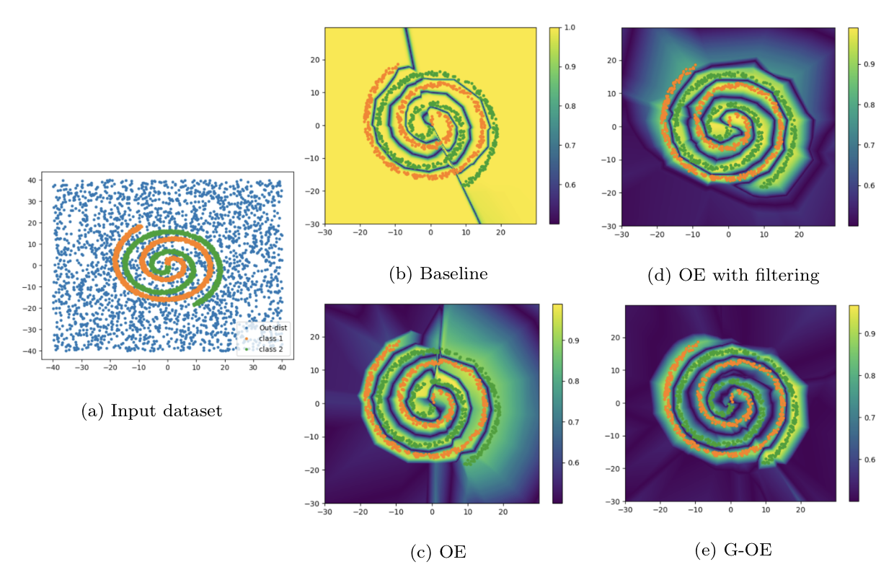
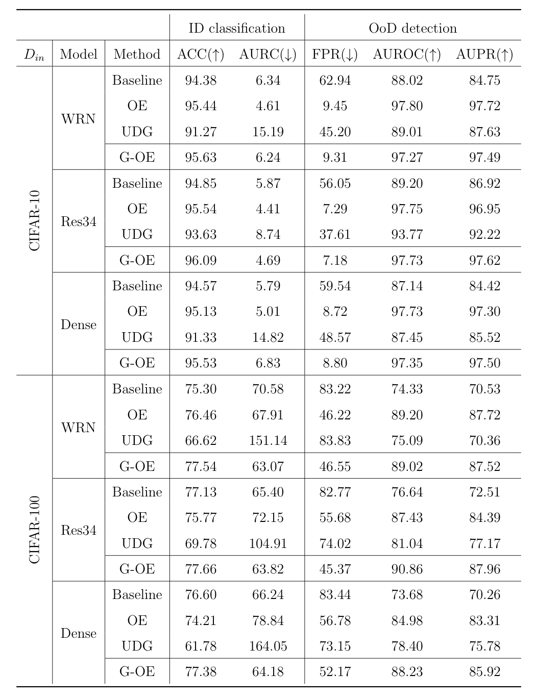

# Generlized-OutlierExposure


This repository is the official implementation of Generalized Outlier Exposure. A part of code has been based on the public code of
[Outlier Exposure](https://github.com/hendrycks/outlier-exposure), [SC-OOD](https://github.com/jingkang50/ICCV21_SCOOD), [Unknown Detection](https://github.com/daintlab/unknown-detection-benchmarks), [Mixup](https://github.com/facebookresearch/mixup-cifar10).



### Environment

* Python >= 3.6

* Pytorch >= 1.9

* CUDA >= 10.2

## In-distribution Dataset
* CIFAR10, CIFAR100

## Outlier Dataset for train

Unlike the original [OE paper](https://arxiv.org/abs/1812.04606), which remove some examples from the outlier dataset, we used the outlier dataset as it is. 

* [**80 Million Tiny Images**](http://www.archive.org/download/80-million-tiny-images-2-of-2/tiny_images.bin)

## Outlier Datasets for test

SC-OOD dataset can be downloaded by the following link: [SC-OOD dataset download](https://drive.google.com/file/d/1cbLXZ39xnJjxXnDM7g2KODHIjE0Qj4gu/view).
* [SC-OOD dataset](https://github.com/jingkang50/ICCV21_SCOOD)
* Blobs
* Gaussian

## Train a model

```Python
python main.py --dataset cifar100 --model res34 --gpu-id 0 --trial 01 --filtered_num 20 ----estimation-func msp --strategy static --save-path ./save-path/
```

## Evaluate a model

```Python
python test.py --dataset cifar100 --model res34 --gpu-id 0 --save-path ./save-path/
```

### Evaluation metrics
* ACC
* AURC
* FRR at 95% TPR
* AUROC
* AUPR

## Results

