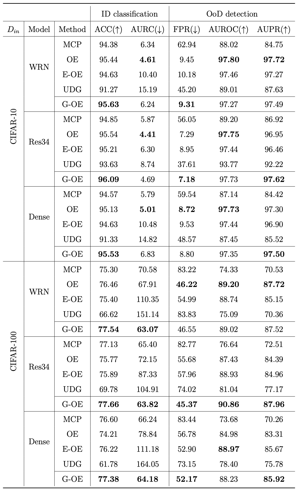

# Generlized-OutlierExposure


This repository is the official implementation of [Generalized Outlier Exposure: Towards a trustworthy out-of-distribution detector without sacrificing accuracy](https://www.sciencedirect.com/science/article/abs/pii/S0925231224001425 ) (Neurocomputing, 2024).

A part of code has been based on the public code of
[Outlier Exposure](https://github.com/hendrycks/outlier-exposure), [SC-OOD](https://github.com/jingkang50/ICCV21_SCOOD), [Unknown Detection](https://github.com/daintlab/unknown-detection-benchmarks), [Mixup](https://github.com/facebookresearch/mixup-cifar10).

# Overview
Generalized OE is an effective training algorithm to obtain a reliable OoD detector in real-world scenarios. Existing OE-based methods have shown strong OoD detection performance, however, they have the performance degradation issue on ID. G-OE successfully overcomes the drawbacks of current OE-based methods by utilizing RandomMixup and a filtering strategy simultaneously.

## Visualize the effect of G-OE

A confidence surface of each experiment on a 2D spiral dataset. The color barrepresents how a model is confident in its predictions:  the higher the confidence, the closerto yellow, and the lower the confidence, the closer to dark blue.

## Environment

* Python >= 3.6

* Pytorch >= 1.9

* CUDA >= 10.2

## In-distribution Dataset
* CIFAR10, CIFAR100

## Outlier Dataset for train
* [**80 Million Tiny Images**](http://www.archive.org/download/80-million-tiny-images-2-of-2/tiny_images.bin)

## Outlier Datasets for test

SC-OOD dataset can be downloaded by the following link: [SC-OOD dataset download](https://drive.google.com/file/d/1cbLXZ39xnJjxXnDM7g2KODHIjE0Qj4gu/view).
* [SC-OOD dataset](https://github.com/jingkang50/ICCV21_SCOOD)
* Blobs
* Gaussian

## Train a model

```Python
python main.py --dataset cifar100 --model res34 --exp-type G-OE --filtered_num 20 --trial 01 --gpu-id 0 --save-path ./save-path/
```
## Evaluate a model

```Python
python test.py --dataset cifar100 --model res34 --conf mcp --gpu-id 0 --datapath --save-path ./save-path/
```
### Arguments

  |       name       |type |   available values   |                               help                             |
  |:----------------:|:---:|:--------------------:|:---------------------------------------------------------------|
  |    dataset       | str |   cifar10, cifar100  |                  choose ID dataset between cifar10 and cifar100|
  |    model         | str |   wrn, dense, res34  |                      choose architecture                       |
  |    batch-size    | int |          int         |                             batch size for ID                  |
  |   oe-batch-size  | int |          int      |                             batch size for OoD                  |
  |     droprate      | float |         float        |                    dropout probability                  |
  |     weight      | float |         float        |             final loss weight for RandomMixup term                 |
  |     oe-weight      | float |         float        |              final loss weight for OE term                  |
  |     filtered_num      | int |   int     |  number of samples to filter out, which indicates hyperparameter k in paper    |
  |     save     | str |    save directory    |             directory where the results will be saved         |
  |      trial       | str |         str          |                 the number of trial experiments                |


### Evaluation metrics
* ACC
* AURC
* FRR at 95% TPR
* AUROC
* AUPR

## Results


## Citation
```
@article{koo2024generalized,
  title={Generalized Outlier Exposure: Towards a trustworthy out-of-distribution detector without sacrificing accuracy},
  author={Koo, Jiin and Choi, Sungjoon and Hwang, Sangheum},
  journal={Neurocomputing},
  pages={127371},
  year={2024}
}
```

### Contact for issues
- Jiin Koo, jiinnine@ds.seoultech.ac.kr
